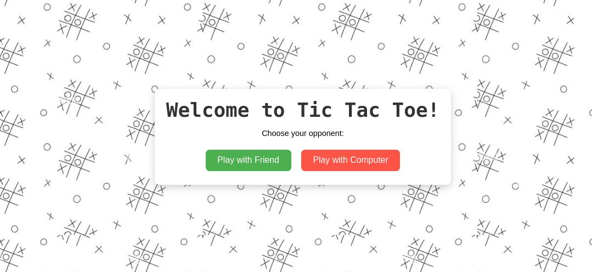

# Tic Tac Toe Game

A simple Tic Tac Toe game implemented in HTML, CSS, and JavaScript.

## Overview

This project is a browser-based Tic Tac Toe game where players can play against each other as 1 vs 1 or against the 1 VS COMPUTER. It includes basic features such as win detection, draw detection, and game reset options.

## Features

- Play against a friend locally.
- Play against the computer (AI).
- Responsive design that adjusts to different screen sizes.
- Simple and intuitive user interface.

## Technologies Used

- HTML
- CSS
- JavaScript

## How to Play

- Visit My Gitub Hosted Website and Play :
(https://shivamds15.github.io/tic-tac-toe-1vs1-comp/)

OR

1. Clone the repository using git clone
2. Open `index.html` in your web browser.
3. Choose to play with a friend or against the computer.
4. Click on the game board to make your move.
5. The game will automatically detect a win, draw, or continue until reset.

## Files Included

- `index.html`: Main HTML file containing the game structure.
- `style.css`: CSS file for styling the game interface.
- `script.js`: JavaScript file containing game logic and event handling.
- `README.md`: This file, containing information about the project.

## Contributions

Contributions are welcome! If you have any suggestions or improvements, please feel free to open an issue or create a pull request.

## License

This project is licensed under the MIT License. See the [LICENSE](LICENSE) file for more details.
